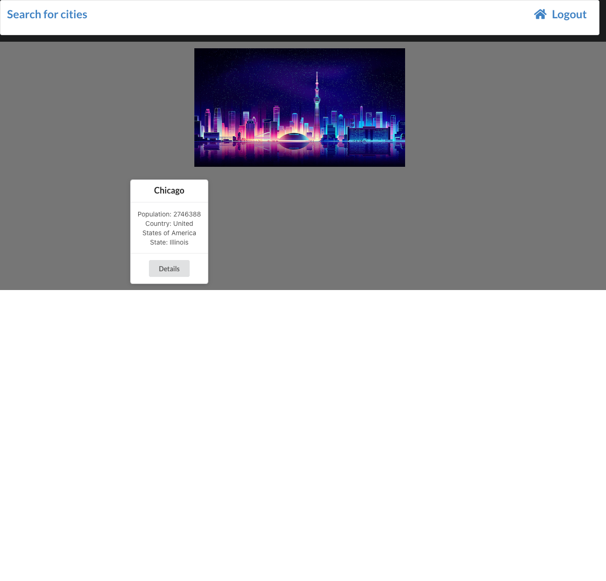
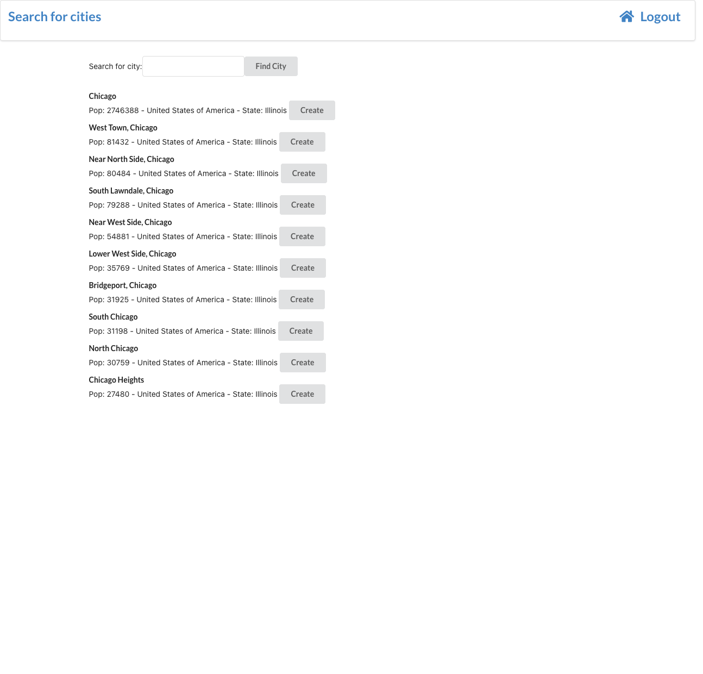
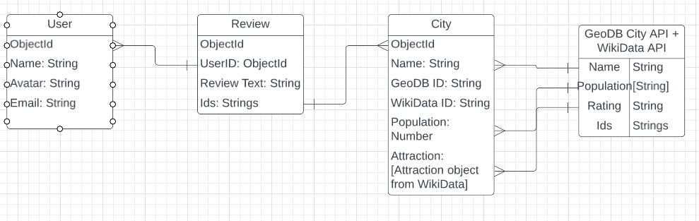

# My Game Reviews Website
https://my-city-reviews.herokuapp.com/
## Website overview
This website allows the user to search through a database of cities and create reviews for others to see.
## Screenshots

## Technologies Used
* Node.js
* Mongoose
* Atlus Database
* geoDB City API, https://rapidapi.com/wirefreethought/api/geodb-cities/details
* React
* Semantic UI
* Heroku
## Purpose of the website
* AAU, I want to be able to search for a city and create a review.
* AAU, I want to be able delete my own reviews.
* AAU, I want to look at all reviews for a city.
* AAU, I want to see a list of cities with reviews.
## Link to trello
[Trello](https://trello.com/b/2F9duqRE/city-reviewer)
## ERD

## Wireframe
[Wireframe](https://www.figma.com/file/dek7vLHMPiYG9b76OiPPNU/city-review?node-id=0%3A1)
## Next Steps
* Learn how to use the WikiData API (documentation is terrible)
* WikiData will allow me to find official photos and local attractions
* Rating system, user profiles, visual enhancements
* More functionality for better user experience

